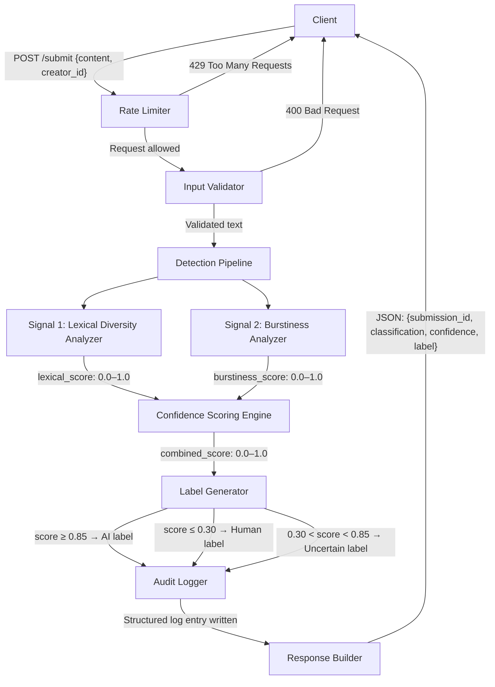
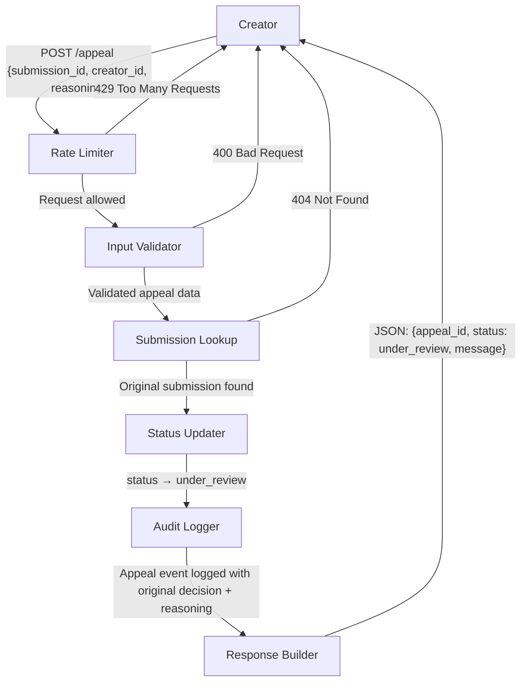
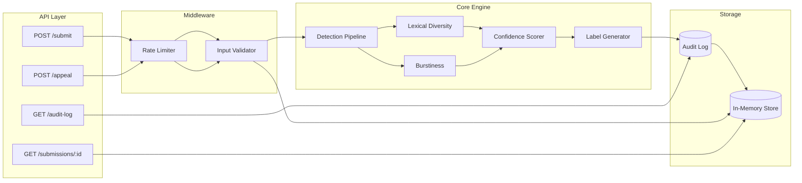

# Provenance Guard — Planning Document

## Architecture Narrative

Here is the complete path a single piece of text takes from submission to the transparency label a user sees:

1. **Client submits text** via `POST /submit` with a JSON body containing the content (e.g., a poem, story excerpt, or blog post) and optional creator metadata.

2. **Rate Limiter** (Flask-Limiter middleware) checks whether the requesting IP/client has exceeded submission thresholds. If the limit is hit, the request is rejected with HTTP 429 before any analysis occurs.

3. **Input Validation** verifies the request body: text must be present, must be between 50 and 10,000 characters, and must be valid UTF-8. Malformed requests are rejected with HTTP 400.

4. **Detection Pipeline** receives the validated text and runs two independent signal analyzers in sequence:
   - **Signal 1 — Lexical Diversity Analyzer**: Computes vocabulary richness metrics (type-token ratio, hapax legomena ratio) to measure how varied the word choices are.
   - **Signal 2 — Burstiness Analyzer**: Measures the variance in sentence lengths and structural patterns to detect the uniformity characteristic of AI-generated text.

5. **Confidence Scoring Engine** takes the two signal scores (each 0.0–1.0, where 1.0 = "strongly suggests AI") and combines them using a weighted average (Signal 1: 0.4, Signal 2: 0.6 — burstiness is weighted higher because it's more robust for creative text). The combined score represents overall confidence that the text is AI-generated.

6. **Label Generator** maps the combined confidence score to one of three transparency label variants using asymmetric thresholds (the system requires stronger evidence to label content as AI than to label it as human, because false positives are more harmful on a creative platform):
   - Score ≥ 0.85 → High-confidence AI label
   - Score ≤ 0.30 → High-confidence Human label
   - 0.30 < Score < 0.85 → Uncertain label

7. **Audit Logger** writes a structured JSON entry capturing: submission ID, timestamp, raw text hash, both signal scores, combined confidence score, label assigned, and request metadata.

8. **Response** is returned to the client as JSON containing: submission ID, classification result ("ai_generated", "human_written", or "uncertain"), confidence score, transparency label text, and timestamp.

---

## Detection Signals

### Signal 1: Lexical Diversity (Type-Token Ratio + Hapax Legomena)

**What it measures:**
The ratio of unique words to total words (type-token ratio, or TTR) and the proportion of words that appear only once in the text (hapax legomena ratio). Together these capture how varied and "surprising" the vocabulary choices are throughout a piece of writing.

**Why this property differs between human and AI writing:**
AI language models draw from a probability distribution that favors common, "safe" word choices. They tend toward a comfortable middle — rarely using very obscure words but also avoiding the natural repetition patterns humans fall into. Human writers, especially creative ones, show more extreme distributions: either deploying highly specialized/unusual vocabulary (a poet reaching for a rare word) or exhibiting natural repetitive tics (a novelist who unconsciously overuses a favorite transition word). AI text produces a suspiciously *uniform* vocabulary distribution — not too rich, not too poor.

**What it can't capture (blind spots):**
- **Short texts** (under ~200 words) don't have enough tokens for meaningful statistical patterns.
- **Non-native English speakers** may show constrained vocabulary that mimics AI patterns.
- **Minimalist writers** (Hemingway-style) deliberately use restricted vocabulary and will appear AI-like.
- **Heavily edited text** — a human who revises extensively may smooth out the natural irregularities that distinguish human writing.
- **Domain-specific technical writing** reuses terminology by necessity, suppressing TTR regardless of origin.

---

### Signal 2: Burstiness (Sentence Length Variance)

**What it measures:**
The statistical variance and coefficient of variation in sentence lengths across the entire text, along with the ratio of very short sentences (≤5 words) to very long ones (≥25 words). This captures the "rhythm" of writing — whether it flows in unpredictable bursts or maintains a steady cadence.

**Why this property differs between human and AI writing:**
Human writing is naturally "bursty." A writer will follow a 40-word complex sentence with a 4-word punch: "But it didn't work." This rhythmic irregularity emerges from the organic thought process of composition. AI models — especially instruction-tuned ones — produce remarkably uniform sentence structures. They tend toward medium-length sentences (12–20 words) with consistent clause patterns. Even when prompted to "vary your style," AI text shows measurably lower variance in sentence length than comparable human text.

**What it can't capture (blind spots):**
- **Academic/technical writing** often maintains uniformly long sentences regardless of human or AI origin.
- **Poetry and experimental prose** deliberately manipulate rhythm, making the signal unreliable for these genres.
- **AI text prompted with explicit style instructions** ("write with short punchy sentences mixed with long flowing ones") can artificially inflate burstiness.
- **Very short texts** with fewer than 5–6 sentences don't provide enough data points for variance to be meaningful.
- **List-heavy content** (blog posts with bullet points) will show artificial burstiness that isn't related to natural writing rhythm.

---

## False Positive Analysis

**Scenario:** A PhD researcher submits an original blog post about quantum computing. Their writing style is precise, methodical, and consistent — traits cultivated through years of academic training. They use domain vocabulary repeatedly (low TTR because "quantum," "superposition," and "decoherence" recur throughout) and maintain uniformly long, complex sentences (low burstiness because academic convention demands sustained argumentation).

**How the system processes this:**

1. **Signal 1 (Lexical Diversity):** TTR is low (~0.45) because of necessary domain term repetition. Hapax ratio is moderate. Signal score: **0.55** (mildly suggests AI).

2. **Signal 2 (Burstiness):** Sentence length variance is low — most sentences are 20–35 words. Coefficient of variation is below the human baseline. Signal score: **0.70** (moderately suggests AI).

3. **Combined Confidence:** (0.4 × 0.55) + (0.6 × 0.70) = 0.22 + 0.42 = **0.64**

4. **Label Assignment:** 0.64 falls in the uncertain range (0.30 < score < 0.85). The system does NOT label this as AI-generated. Instead, the label says: *"We couldn't confidently determine this content's origin. Our analysis was inconclusive (confidence: 64%). The creator may request a review if they believe this assessment is inaccurate."*

5. **What this gets right:** The asymmetric thresholds protect the human writer. Even though both signals lean toward "AI," the combined score of 0.64 is nowhere near the 0.85 threshold required to label content as AI-generated. The system defaults to uncertainty rather than making an accusation.

6. **If the creator appeals:** They submit `POST /appeal` with their reasoning: "I am a quantum computing researcher and this is my original work. My academic writing style naturally uses repeated domain terminology and complex sentence structures." The system:
   - Updates the submission status to `under_review`
   - Logs the appeal in the audit log with the creator's reasoning alongside the original classification
   - Returns confirmation that the appeal has been received
   - A human reviewer can later examine the case

**Design lesson this teaches:** The 0.85 threshold for AI labeling is deliberately high. The system should say "I don't know" far more often than it accuses a human of using AI. On a creative platform, being wrongly accused of plagiarism or AI use is deeply harmful — it's better to miss some AI content than to wrongly stigmatize human creators.

---

## API Surface

### POST /submit
**Purpose:** Submit text content for AI/human attribution analysis.

**Accepts:**
```json
{
  "content": "string (50–10000 chars, required)",
  "creator_id": "string (optional, for tracking)",
  "content_type": "string (optional: 'poem', 'story', 'blog', 'essay'; defaults to 'general')"
}
```

**Returns (200 OK):**
```json
{
  "submission_id": "uuid",
  "classification": "ai_generated | human_written | uncertain",
  "confidence_score": 0.0-1.0,
  "signals": {
    "lexical_diversity": { "score": 0.0-1.0, "details": {} },
    "burstiness": { "score": 0.0-1.0, "details": {} }
  },
  "transparency_label": "string (the user-facing label text)",
  "timestamp": "ISO 8601"
}
```

**Error responses:** 400 (invalid input), 429 (rate limited)

---

### POST /appeal
**Purpose:** Contest a classification decision.

**Accepts:**
```json
{
  "submission_id": "uuid (required)",
  "creator_id": "string (required)",
  "reasoning": "string (required, 20–2000 chars)"
}
```

**Returns (200 OK):**
```json
{
  "appeal_id": "uuid",
  "submission_id": "uuid",
  "status": "under_review",
  "message": "Your appeal has been received. The original classification has been marked for review.",
  "timestamp": "ISO 8601"
}
```

**Error responses:** 400 (invalid input), 404 (submission not found), 429 (rate limited)

---

### GET /submissions/<submission_id>
**Purpose:** Retrieve a specific submission's classification result and current status.

**Returns (200 OK):**
```json
{
  "submission_id": "uuid",
  "classification": "ai_generated | human_written | uncertain",
  "confidence_score": 0.0-1.0,
  "transparency_label": "string",
  "status": "classified | under_review | overturned",
  "appeal": null | { "appeal_id": "uuid", "reasoning": "string", "submitted_at": "ISO 8601" },
  "timestamp": "ISO 8601"
}
```

---

### GET /audit-log
**Purpose:** Retrieve the structured audit log showing all classification decisions and appeals.

**Query params:** `?limit=20&offset=0`

**Returns (200 OK):**
```json
{
  "entries": [
    {
      "entry_id": "uuid",
      "event_type": "classification | appeal | status_change",
      "submission_id": "uuid",
      "timestamp": "ISO 8601",
      "details": {}
    }
  ],
  "total_count": 42,
  "limit": 20,
  "offset": 0
}
```

---

## Architecture

### Submission Flow Diagram



### Appeal Flow Diagram



### Component Interaction Summary



---

## Transparency Label Variants

### High-Confidence AI (score ≥ 0.85)
> "⚠️ AI-Generated Content — Our analysis indicates this content was likely produced by an AI system (confidence: {score}%). Readers should consider this context when evaluating the work. The creator may appeal this classification."

### High-Confidence Human (score ≤ 0.30)
> "✓ Original Human Work — Our analysis indicates this content was written by a human (confidence: {100 - score}%). No significant indicators of AI generation were detected."

### Uncertain (0.30 < score < 0.85)
> "? Inconclusive — We couldn't confidently determine this content's origin (confidence: {score}% AI-likelihood). Our analysis was not definitive. The creator may request a review if they believe this assessment is inaccurate."

---

## Rate Limiting Strategy

**Submission endpoint (`POST /submit`):** 10 requests per minute, 50 per hour per IP.

**Reasoning:**
- A legitimate creator on a writing platform submits work infrequently — maybe 2–5 pieces per day. Even a power user wouldn't need more than 10 analyses per minute.
- An adversary trying to reverse-engineer detection thresholds would need hundreds of rapid submissions with slight text variations. 10/min makes this tedious without blocking legitimate use.
- The hourly cap (50) prevents sustained automated probing over longer periods.

**Appeal endpoint (`POST /appeal`):** 3 per hour per IP.

**Reasoning:**
- Appeals are rare, deliberate actions. A creator might appeal 1–2 classifications per day at most.
- Limiting to 3/hour prevents abuse of the appeal system while ensuring a legitimate creator who received multiple unfair classifications can still contest them.

**Read endpoints (`GET /submissions/:id`, `GET /audit-log`):** 30 per minute per IP.

**Reasoning:**
- Read operations are cheap and users may paginate through results.
- Higher limit since these don't trigger computation.

---

## Confidence Scoring Design Philosophy

The confidence score is a **design decision** before it is a technical one:

- **0.0** means "we are certain this is human-written"
- **0.5** means "we genuinely have no idea — the signals are contradictory or insufficient"
- **1.0** means "we are certain this is AI-generated"

The score is NOT a probability in the statistical sense — it's a communication tool. When we say "confidence: 64% AI-likelihood," we're telling the user: "our signals lean toward AI, but not strongly enough for us to stake a claim."

**Asymmetric thresholds reflect asymmetric harm:**
- Labeling a human's work as AI (false positive) → damages their reputation, undermines their creative identity
- Missing AI content (false negative) → less harmful; the content just goes unlabeled

Therefore: the system requires overwhelming evidence (0.85+) to label something as AI, but only moderate evidence (0.30 or below) to affirm it as human. The wide "uncertain" band (0.30–0.85) is intentional — the system says "I don't know" far more often than it accuses.

---

## Technology Stack

- **Framework:** Flask (lightweight, appropriate for API-focused service)
- **Rate Limiting:** Flask-Limiter (Redis-backed in production, in-memory for development)
- **Storage:** In-memory data structures (dict-based) for this prototype; production would use PostgreSQL
- **Audit Log:** JSON-structured entries stored in-memory, accessible via GET endpoint
- **Text Analysis:** Pure Python with standard library (re, collections, statistics) — no ML model dependencies for the two core signals
- **Optional AI Signal:** Groq API for a third ensemble signal (stretch goal)

---

## File Structure (Planned)

```
provenance-guard/
├── app.py                  # Flask application factory & route definitions
├── detection/
│   ├── __init__.py
│   ├── pipeline.py         # Orchestrates signals and scoring
│   ├── lexical.py          # Signal 1: Lexical diversity analysis
│   ├── burstiness.py       # Signal 2: Sentence structure variance
│   └── confidence.py       # Weighted scoring and label generation
├── models/
│   ├── __init__.py
│   └── store.py            # In-memory data store for submissions & appeals
├── audit/
│   ├── __init__.py
│   └── logger.py           # Structured audit logging
├── planning.md
├── README.md
├── requirements.txt
└── .gitignore
```
